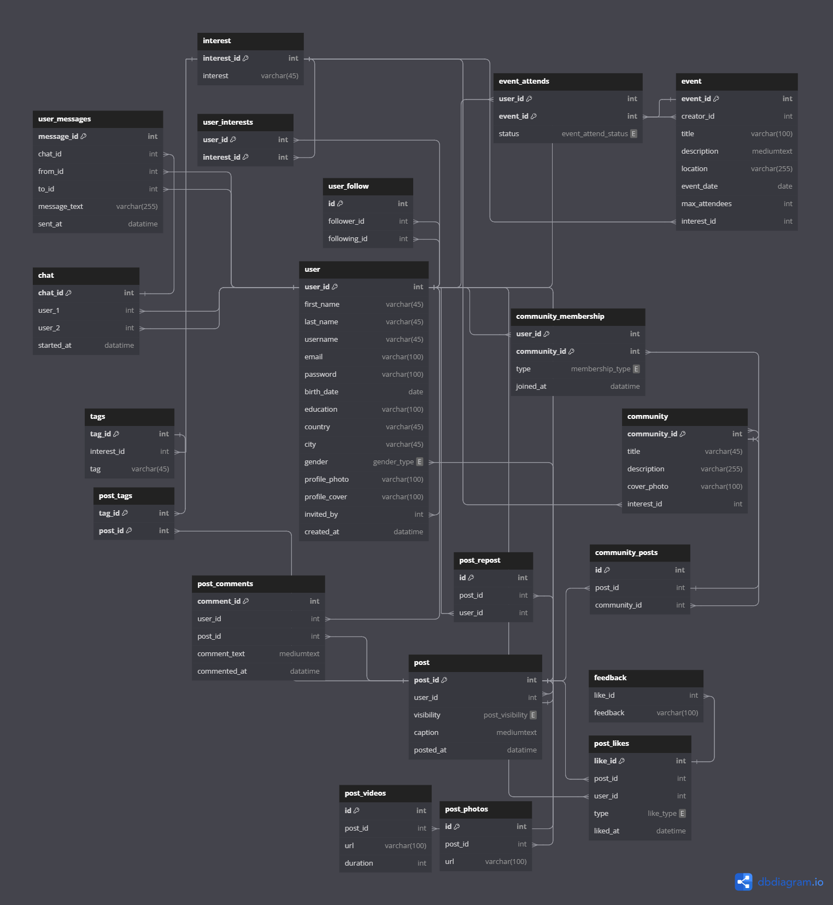

## **Intro**

## **Tools**

* diagram design: [dbdiagram.io](https://dbdiagram.io)
* sketches: [Excalidraw](https://excalidraw.com/)
* mock data using [mockaroo](https://www.mockaroo.com/)
* Python to fix and manipulate the data

## Requirements

### *Problem Statement:*

Most of social media platforms are based on different aspects

- **Facebook:** engagements.
- **Linkedin:** networking and connections.
- **Twitter:** news and discussions.
- **TikTok:** short-form video entertainment.
- **Instagram:** visuals and reels.
- **Reddit:** subcommunities.

But what about a new platform which is mainly based on the content?

### *Platform Vision and Outlines:*

* Focus on insightful and valuable content, encouraging users to share meaningful posts.
* Motivate regular participation through features like active-user streaks and badges for top contributors in different topics.
* Make trending topics and impactful posts easily discoverable.
* **Like** and **Dislike** options, with required feedback for dislikes, to support a respectful, quality-focused environment.

### *Database Requirements:*

* **User:**

  * Allowed to create account which has their main info.
  * Send invitation links for other people.
  * Follow other users.
  * Interact with other people posts, repost them, and write his posts.
  * Chat and send messages to other users.
* **Post:**

  * Has a caption, and may has different media (photos and videos).
  * Should be assigned to one or more tags.
  * Can be reposted by different users or the auther himself.
  * Has comments section.
  * Anlyzing its likes, dislikes, comments, and reposts.
* **Analysis:**

  * Track user streak of sharing posts.
  * Top voice uses in some topics.
  * Trended posts and topics.
  * Highly liked and disliked posts (with the reasons).
  * Recommended user to follow.
  * The least active users.
  * Predicted and actual attendee users to events.
* Chat:

## **ER Diagram**

## **Relational Model**

<a href="https://dbdiagram.io/d/university-DBMS-project-672a3b04e9daa85aca67484d" target="_blank">show on dbdiagram.io</a>

## **How to run this database on your machine**
You should first make sure that you have `xampp` and `mysql` are installed. After that clone the project using `git clone https:`

Finally run this command on cmd inside the `xampp\mysql\bin` directory:
```
mysql -u root -p < fullpath\to\database_creation.sql
```
it will create the database and insert all data within a few seconds.
## Queries and Analysis
1) List interests and its tags
2) Each user with its info
3) Active time for publish posts in day time slots
4) Top voice in each topic
5) Number of interests for each post
## Conclusion
